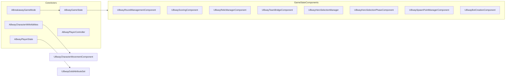
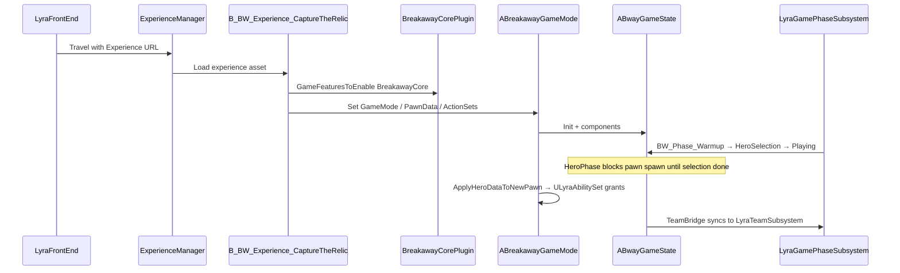

# ProjectB Vertical Slice — State Review, Documentation, and Gap Plan

## Locked Slice Definition (from grill-me)

| Decision    | Your choice                                                                                                                                                      |
| ----------- | ---------------------------------------------------------------------------------------------------------------------------------------------------------------- |
| Slice bar   | Design-spec: 4v4 relic mode, multi-hero, buildables, match-only gold                                                                                             |
| Heroes      | 4 distinct — **Spartacus, Morgan Le Fay, Alona, Rawlins** (design-spec first quartet)                                                                            |
| Buildables  | Full cross-round persistence within a Best-of-5 match                                                                                                            |
| Gold        | Persists between rounds; resets on match end (no SaveGame / campaign)                                                                                            |
| Multiplayer | Listen server 4v4 (8 players), bots fill empty slots                                                                                                             |
| Maps        | **L_BW_DevMap** (CI/integration) + **L_BW_Dorado** (demo) at parity                                                                                              |
| Campaign    | Out of scope                                                                                                                                                     |
| Docs        | **Both synced** — `[BreakawayCore/Docs/](Plugins/GameFeatures/BreakawayCore/Docs/)` for dev reference; `[AI_Planning/](AI_Planning/)` for slice planning/roadmap |

---

## Part 1 — Current Code State (BreakawayCore)

BreakawayCore is a **Game Feature Plugin** at `[Plugins/GameFeatures/BreakawayCore/](Plugins/GameFeatures/BreakawayCore/)` — **not** listed in `[ProjectB.uproject](ProjectB.uproject)`. It loads via Lyra's Game Features pipeline (`ExplicitlyLoaded`, `BuiltInInitialFeatureState: Loaded`).

**~56 C++ classes** in `BreakawayCoreRuntime`, organized into:

### What is implemented (strong)

| System                  | Status              | Key files                                                                                                                                                                                                                                                                                                                                                        |
| ----------------------- | ------------------- | ---------------------------------------------------------------------------------------------------------------------------------------------------------------------------------------------------------------------------------------------------------------------------------------------------------------------------------------------------------------- |
| Match flow / rounds     | Done in C++         | `[BwayRoundManagementComponent](Plugins/GameFeatures/BreakawayCore/Source/BreakawayCoreRuntime/Public/GameState/BwayRoundManagementComponent.h)` — 3 win conditions, round timer, match end                                                                                                                                                                      |
| Scoring                 | Done                | `[BwayScoringComponent](Plugins/GameFeatures/BreakawayCore/Source/BreakawayCoreRuntime/Public/GameState/BwayScoringComponent.h)`                                                                                                                                                                                                                                 |
| Teams + Lyra bridge     | Done                | `[BwayTeamBridgeComponent](Plugins/GameFeatures/BreakawayCore/Source/BreakawayCoreRuntime/Public/GameState/BwayTeamBridgeComponent.h)` → `ULyraTeamSubsystem`                                                                                                                                                                                                    |
| Hero selection pipeline | Done in C++         | `[BwayHeroSelectionPhaseComponent](Plugins/GameFeatures/BreakawayCore/Source/BreakawayCoreRuntime/Public/HeroSystems/BwayHeroSelectionPhaseComponent.h)`, `[BwayHeroSelectionManager](Plugins/GameFeatures/BreakawayCore/Source/BreakawayCoreRuntime/Public/HeroSystems/BwayHeroSelectionManager.h)`                                                             |
| Relic core              | Done                | `[RelicActor](Plugins/GameFeatures/BreakawayCore/Source/BreakawayCoreRuntime/Public/Relic/RelicActor.h)`, `[BwayRelicManagerComponent](Plugins/GameFeatures/BreakawayCore/Source/BreakawayCoreRuntime/Public/GameState/BwayRelicManagerComponent.h)`, `[BwayGoalVolume](Plugins/GameFeatures/BreakawayCore/Source/BreakawayCoreRuntime/Public/BwayGoalVolume.h)` |
| Spawn system            | Done + documented   | `[BwaySpawnPointManagerComponent](Plugins/GameFeatures/BreakawayCore/Source/BreakawayCoreRuntime/Public/SpawnSystem/BwaySpawnPointManagerComponent.h)`, existing docs in `BreakawayCore/Docs/SpawnSystem_*`                                                                                                                                                      |
| Spartacus abilities     | 4 C++ GAS abilities | `[Abilities/](Plugins/GameFeatures/BreakawayCore/Source/BreakawayCoreRuntime/Public/Abilities/)` — Shield Bash, War Cry, Defensive Stance, Gladiator's Leap                                                                                                                                                                                                      |
| Slide movement          | C++ custom mode     | `[BwayCharacterMovementComponent](Plugins/GameFeatures/BreakawayCore/Source/BreakawayCoreRuntime/Public/BwayCharacterMovementComponent.h)`, `[BwayGameplayAbility_Slide](Plugins/GameFeatures/BreakawayCore/Source/BreakawayCoreRuntime/Public/BwayGameplayAbility_Slide.h)`                                                                                     |
| Economy (match)         | Mostly done         | `[BwayGoldAttributeSet](Plugins/GameFeatures/BreakawayCore/Source/BreakawayCoreRuntime/Public/Economy/BwayGoldAttributeSet.h)` on PlayerState ASC; kill/goal/passive gold in RoundManagement; spend check in `[BwayBuildablePlacementLibrary](Plugins/GameFeatures/BreakawayCore/Source/BreakawayCoreRuntime/Public/Buildable/BwayBuildablePlacementLibrary.h)`  |
| Buildable foundation    | Partial             | `[BuildableBase](Plugins/GameFeatures/BreakawayCore/Source/BreakawayCoreRuntime/Public/Buildable/BuildableBase.h)` — `bPersistsBetweenRounds=true` default; round reset only destroys non-persisting actors (lines 286–294 in RoundManagement cpp)                                                                                                               |
| UI C++ bases            | Done                | 12 widget bases under `[Public/UI/](Plugins/GameFeatures/BreakawayCore/Source/BreakawayCoreRuntime/Public/UI/)`                                                                                                                                                                                                                                                  |
| Bots                    | Component exists    | `[BwayBotCreationComponent](Plugins/GameFeatures/BreakawayCore/Source/BreakawayCoreRuntime/Public/GameState/BwayBotCreationComponent.h)`                                                                                                                                                                                                                         |

### What is missing or incomplete (gaps vs your slice)

| Gap                             | Severity | Evidence                                                                                                                                                                                                                                                                 |
| ------------------------------- | -------- | ------------------------------------------------------------------------------------------------------------------------------------------------------------------------------------------------------------------------------------------------------------------------ |
| **3 of 4 heroes**               | Critical | Only Spartacus has C++ abilities; no `/GameFeatures/Heroes/`* plugins exist; `[BwayHeroPluginLoader](Plugins/GameFeatures/BreakawayCore/Source/BreakawayCoreRuntime/Public/HeroSystems/BwayHeroPluginLoader.h)` expects per-hero GF plugins                              |
| **Hero buildables (8 total)**   | Critical | Generic `ATurretBase`/`ATrapBase` exist; no hero-specific buildable classes or data assets wired                                                                                                                                                                         |
| **Blueprint/content wiring**    | Critical | `.uasset` content not in git; config references `/BreakawayCore/Experiences/B_BW_Experience_CaptureTheRelic`, `BP_BW_GameState`, phase abilities, HUD widgets — must be audited in Editor                                                                                |
| **Relic net polish**            | High     | `[PROJECT_ROADMAP.md](AI_Planning/PROJECT_ROADMAP.md)` Phase 2 — interpolation, prediction, edge-case scoring                                                                                                                                                            |
| **Buildable net replication**   | High     | Buildables replicate team/owner; cross-round persistence under listen-server 4v4 needs verification + possibly registration list on GameState                                                                                                                            |
| **Duplicate state (tech debt)** | Medium   | `[project_architecture_overview.md](AI_Planning/project_architecture_overview.md)` warns teams/scores/relic tracked on both `ABwayGameState` and components                                                                                                              |
| **Stale docs**                  | Medium   | `UBwayAssetManager` in architecture doc — **class does not exist**; project uses `[ULyraAssetManager](Source/LyraGame/System/LyraAssetManager.h)` + `[Config/DefaultGame.ini](Config/DefaultGame.ini)` primary asset scans                                               |
| **Scoreboard/MVP TODOs**        | Low      | `[BwayScoreboardWidget.cpp](Plugins/GameFeatures/BreakawayCore/Source/BreakawayCoreRuntime/Private/UI/BwayScoreboardWidget.cpp)`, `[BwayResultsScreenWidget.cpp](Plugins/GameFeatures/BreakawayCore/Source/BreakawayCoreRuntime/Private/UI/BwayResultsScreenWidget.cpp)` |
| **Slide net steering**          | Medium   | `[Vertical_Slice_Roadmap.md](AI_Planning/Vertical_Slice_Roadmap.md)` — velocity steering may jitter under latency                                                                                                                                                        |

**Readiness estimate vs your slice:** C++ gameplay loop ~75%; content/Blueprint wiring unknown; 4-hero + 8-buildable content ~15%; 4v4 listen polish ~40%.

---

## Part 2 — Lyra Base and Interaction Model

Lyra lives in `[Source/LyraGame/](Source/LyraGame/)` (~450 files). BreakawayCore **extends, does not replace**, Lyra's stack.

### Lyra responsibilities (unchanged)

| Layer              | Lyra types                                                       | Role                                                     |
| ------------------ | ---------------------------------------------------------------- | -------------------------------------------------------- |
| Boot               | `ULyraGameInstance`, `B_LyraFrontEnd_Experience`                 | Front-end menu, sessions                                 |
| Experience loading | `ULyraExperienceManagerComponent`, `ULyraExperienceDefinition`   | Async load experience, enable GF plugins, run ActionSets |
| GAS foundation     | `ULyraAbilitySystemComponent`, `ULyraAbilitySet`, attribute sets | ASC on PlayerState, ability grants                       |
| Phases             | `ULyraGamePhaseSubsystem`, `ULyraGamePhaseAbility`               | Match phase tags gate input/abilities                    |
| Teams              | `ULyraTeamSubsystem`                                             | Team queries for HUD/cues                                |
| UI stack           | CommonUI + `UCommonUIExtensions`                                 | Activatable widget push/pop                              |
| Asset management   | `ULyraAssetManager`                                              | Primary asset scanning (Breakaway paths added in config) |

### Breakaway injection points

### Editor / Blueprint wiring (expected asset graph)

Config + code reference these paths (verify in Editor):

| Asset                                                        | Purpose                                                                                                |
| ------------------------------------------------------------ | ------------------------------------------------------------------------------------------------------ |
| `/BreakawayCore/Experiences/B_BW_Experience_CaptureTheRelic` | Main slice experience — enables GF, sets pawn data, phase abilities, input/HUD action sets             |
| `B_BWayGameMode_Default` (BP)                                | Subclass of `ABreakawayGameMode`                                                                       |
| `BP_BW_GameState`                                            | **Must add** Round, Scoring, Relic, TeamBridge components (C++ only creates Hero/Bot/Spawn components) |
| `DA_BW_PawnData_Humanoid`                                    | Points to `ABwayCharacterWithAbilities` + input config                                                 |
| `BW_Phase_`* abilities                                       | Warmup, HeroSelection, Playing, PostRound, PostGame                                                    |
| `WBP_BW_`* widgets                                           | HUD, hero select, scoreboard, results, pause                                                           |
| `/BreakawayCore/Maps/L_BW_DevMap`, `L_BW_Dorado`             | Arena maps with tagged spawn points                                                                    |

**Lyra sample dependencies:** BreakawayCore depends on `[ShooterCore](Plugins/GameFeatures/ShooterCore/)`, `[ShooterCTF](Plugins/GameFeatures/ShooterCTF/)`, `[ShooterExplorer](Plugins/GameFeatures/ShooterExplorer/)` — reuses phase tag patterns and CTF spawn infrastructure. These are reference patterns, not the main game loop.

**Config touchpoints:**

- `[Config/DefaultEngine.ini](Config/DefaultEngine.ini)` — `GlobalDefaultGameMode`, front-end map
- `[Config/DefaultGame.ini](Config/DefaultGame.ini)` — AssetManager scans, LyraGameFeaturePolicy, GAS globals
- `[Config/DefaultGameplayTags.ini](Config/DefaultGameplayTags.ini)` + `[BreakawayCore/Config/Tags/BreakawayCore.ini](Plugins/GameFeatures/BreakawayCore/Config/Tags/BreakawayCore.ini)` — phase, relic, spawn, input tags

---

## Part 3 — Documentation Deliverable Plan (Both Synced)

### A. BreakawayCore/Docs/ — developer system reference (new + refresh)

Create a `**SYSTEMS_INDEX.md`** hub linking:

| Doc                                   | Action                | Contents                                                                                   |
| ------------------------------------- | --------------------- | ------------------------------------------------------------------------------------------ |
| `Lyra_Integration.md`                 | **New**               | Experience pipeline, inheritance map, TeamBridge, phase tags, ActionSets, config cross-ref |
| `MatchFlow_and_Phases.md`             | **New**               | Round states, win conditions, hero-select gate, PostGame → front-end travel                |
| `Relic_System.md`                     | **New** (consolidate) | State machine, networking, goal scoring, carrier abilities, known Phase-2 gaps             |
| `Buildable_System.md`                 | **New**               | Placement GAS flow, persistence flag, replication concerns, 2-per-hero matrix              |
| `Economy_Gold.md`                     | **New**               | Attribute set, award sources, spend path, round vs match boundaries                        |
| `GAS_and_Abilities.md`                | **New**               | Ability hierarchy, Spartacus reference impl, hero data asset contract                      |
| `UI_System.md`                        | **New**               | Widget base classes, CommonUI push pattern, BP subclass checklist                          |
| `Networking.md`                       | **New**               | Authority boundaries, listen-server 4v4, relic/buildable replication risks                 |
| Existing spawn/hero-select docs       | **Refresh**           | Fix stale refs, cross-link to index                                                        |
| `Spartacus_Implementation_Summary.md` | **Refresh**           | Align with current ability headers                                                         |

Each doc: class table, key functions, Blueprint hooks, gameplay tags, asset paths, known TODOs.

### B. AI_Planning/ — slice planning (update + new)

| Doc                                | Action                                                                                                                                  |
| ---------------------------------- | --------------------------------------------------------------------------------------------------------------------------------------- |
| `VERTICAL_SLICE_DEFINITION.md`     | **New** — locked scope table from grill-me (source of truth)                                                                            |
| `project_architecture_overview.md` | **Fix** — remove `UBwayAssetManager`; mark duplicate-state debt; add readiness matrix                                                   |
| `Vertical_Slice_Roadmap.md`        | **Realign** — prioritize 4 heroes, buildables, 4v4 net over campaign/SaveGame                                                           |
| `PROJECT_ROADMAP.md`               | **Update phases** — Phase 2 Relic, Phase 3 Spartacus content (BP), Phase 4 Morgan/Alona/Rawlins, Phase 5 Buildables, Phase 6 4v4 polish |
| `BLUEPRINT_INTEGRATION_GUIDE.md`   | **Refresh** — add BP_BW_GameState component checklist, experience asset field-by-field                                                  |
| `BLUEPRINT_ASSET_AUDIT.md`         | **New template** — Editor checklist to fill per-map/per-experience (content not in git)                                                 |
| `Lyra_Base_Reference.md`           | **New** — what Lyra provides vs what Breakaway owns (onboarding doc)                                                                    |
| `VerticalSlice_AssetMap.html`      | **Update** — hero/buildable completion stats after audit                                                                                |

**Sync rule:** Dev facts live in `BreakawayCore/Docs/`; slice priority/schedule lives in `AI_Planning/`. Cross-link both ways; no duplicate prose — planning docs link to system docs for detail.

---

## Part 4 — Implementation Roadmap (Gap Fill)

Ordered for your locked slice. Each phase ends with a playtest gate on **DevMap**; Dorado parity tracked in parallel.

### Phase 0 — Audit and doc baseline (1–2 days)

- Run Editor asset audit using new `BLUEPRINT_ASSET_AUDIT.md` template
- Confirm `BP_BW_GameState` has Round/Scoring/Relic/TeamBridge components
- Confirm experience asset enables BreakawayCore + correct pawn/game mode classes
- Generate/refreshed docs from Part 3
- Fix stale references in existing planning docs

### Phase 1 — Playable loop on DevMap (3–5 days)

- Wire `B_BW_Experience_CaptureTheRelic` end-to-end: front-end → DevMap → hero select → round → score → results → lobby
- Spartacus-only smoke test with bots filling to 8
- Verify match-only gold carries round-to-round (already on PlayerState ASC — confirm no accidental reset)
- Verify buildables with `bPersistsBetweenRounds=true` survive `ResetRoundState()`

### Phase 2 — Relic + net polish (2–3 days)

- Implement `[PROJECT_ROADMAP.md](AI_Planning/PROJECT_ROADMAP.md)` Phase 2 items: smoothing, LastPossessingTeam edge cases, scoring cooldown
- Latency test at 200ms on listen server

### Phase 3 — Spartacus content complete (3–4 days)

- Hero data asset, mesh/anim, 4 ability BPs + GEs + input bindings, relic carrier restrictions
- 2 Spartacus buildables (Fire Catapult, Dragon Spire per design spec) — BP subclasses of turret/trap base
- Placement ability + gold spend

### Phase 4 — Heroes 2–4 (5–10 days each, parallelizable)

Per hero Game Feature plugin pattern (`/GameFeatures/Heroes/<Name>/`):

- `UBwayHeroDataAsset` + `ULyraAbilitySet` + C++ or BP abilities per design spec
- 2 buildables each (8 total across roster)
- Register in `UBwayGameFeatureData` / hero registry scan paths

Recommended order: **Morgan** (controller/debuff — tests zone denial) → **Alona** (support — tests ally effects) → **Rawlins** (ranged — tests hitscan/projectile pipeline)

### Phase 5 — Buildable persistence hardening (3–5 days)

- Server-authoritative buildable registry on GameState (optional but recommended for 4v4 reliability)
- Replicate persisted buildables to late joiners
- Between-round "planning window" UI hook for spending gold on buildables (even minimal)

### Phase 6 — 4v4 listen server + map parity (3–5 days)

- Bot backfill to 8; team balance via `[ABreakawayGameMode::GetTeamWithFewerPlayers](Plugins/GameFeatures/BreakawayCore/Source/BreakawayCoreRuntime/Public/BreakawayGameMode.h)`
- Dorado map: mirror DevMap spawn tags, goals, relay volumes
- Scoreboard K/D/A + objective columns (PlayerState stats already replicated)
- Slide net tuning if jitter observed

### Explicitly deferred (per your scope)

- Ascension Rites campaign
- SaveGame / meta progression
- Production art pass (mythological theming, Lumen polish) — track in roadmap but not slice gate

---

## Part 5 — Architecture Debt to Address During Implementation

1. **Consolidate duplicate GameState vs component state** — pick single source of truth for teams/scores/relic carrier; components should own logic, GameState exposes delegates only
2. **Replace ShooterCTF spawn-tag coupling** — migrate to Breakaway-native tags in `[BreakawayCore.ini](Plugins/GameFeatures/BreakawayCore/Config/Tags/BreakawayCore.ini)` (already partially defined)
3. **Hero plugin structure** — create `/GameFeatures/Heroes/` template plugin; document in `GAS_and_Abilities.md`
4. **Playing phase tag** — RoundManagement defaults to `ShooterGame.GamePhase.Playing`; align experience phase abilities to Breakaway tags or document the intentional ShooterCore inheritance

---

## Part 6 — Verification Gates (Definition of Done)

**DevMap gate:**

- 8-player listen server (mix human + bot)
- 4 distinct heroes selectable (no duplicate-hero rule respected)
- Best-of-5 rounds with 3 win conditions
- Relic pass/throw/score/fumble functional
- Gold earned and spent between rounds; persists within match
- 2 buildables per hero placeable; structures persist Round 1 → Round 2
- Results screen → return to Lyra front-end

**Dorado gate:** Same checklist on production map layout.

**Doc gate:** All Part 3 docs exist, cross-linked, no references to non-existent classes.

---

## Recommended Next Step After Plan Approval

1. Execute Phase 0 (Editor asset audit + doc generation) — requires your Editor open to fill content gaps git cannot see
2. You recompile after any C++ changes per project rules
3. Run DevMap smoke test with `BwayCheatManager` exec commands (`ShowHeroSelect`, etc.)

