# Breakaway — Project Architecture Overview

> **Goal**: Vertical slice of Breakaway — a team-based arena game with hero selection, relic capture, and buildable structures — built on top of Lyra as a **GameFeature Plugin** (`BreakawayCore`).

---

## System Map

```mermaid
graph TB
    subgraph Lyra["Lyra Framework (Engine Layer)"]
        LyraGM["ALyraGameMode"]
        LyraGS["ALyraGameState"]
        LyraPS["ALyraPlayerState"]
        LyraPC["ALyraPlayerController"]
        LyraChar["ALyraCharacter"]
        ExpDef["ULyraExperienceDefinition"]
        PhaseSubsys["Game Phase Subsystem"]
        TeamSubsys["ULyraTeamSubsystem"]
        AbilitySet["ULyraAbilitySet"]
        PawnData["ULyraPawnData"]
        AssetMgr["UAssetManager"]
        CommonUI["CommonUI / Activatable Widgets"]
        FrontEnd["B_LyraFrontEnd_Experience"]
    end

    subgraph Bway["BreakawayCore Plugin"]
        subgraph Core["Core Framework"]
            BwGM["ABreakawayGameMode"]
            BwGS["ABwayGameState"]
            BwPS["ABwayPlayerState"]
            BwPC["ABwayPlayerController"]
            BwChar["ABwayCharacterWithAbilities"]
            BwCMC["UBwayCharacterMovementComponent"]
        end

        subgraph GSComps["GameState Components"]
            RoundMgmt["UBwayRoundManagementComponent"]
            Scoring["UBwayScoringComponent"]
            RelicMgr["UBwayRelicManagerComponent"]
            TeamBridge["UBwayTeamBridgeComponent"]
            BuildReg["UBwayBuildableRegistryComponent"]
        end

        subgraph Hero["Hero Systems"]
            HeroData["UBwayHeroDataAsset"]
            HeroReg["UBwayHeroRegistry"]
            HeroSelMgr["UBwayHeroSelectionManager"]
            HeroPhase["UBwayHeroSelectionPhaseComponent"]
            HeroWidget["UBwayHeroSelectWidget"]
        end

        subgraph RelicSys["Relic System"]
            RelicActor["ARelicActor"]
            GoalVol["ABwayGoalVolume"]
            RelicSettings["URelicSettings"]
            RelicMoveRep["URelicMovementReplicationComponent"]
        end

        subgraph SpawnSys["Spawn System"]
            SpawnMgr["UBwaySpawnPointManagerComponent"]
            SpawnPt["ABwaySpawnPoint"]
            SpawnData["UBwaySpawnPointData"]
        end

        subgraph Build["Buildable System"]
            BuildBase["ABuildableActor"]
            Turret["ATurretBase"]
            Trap["ATrapBase"]
            BuildData["UBwayBuildableDataAsset"]
        end

        subgraph Econ["Economy (GAS)"]
            GoldAttr["UBwayGoldAttributeSet"]
        end

        subgraph UILayer["UI Layer"]
            CoreHUD["UBwayCoreHUDWidget"]
            ScoreW["BwayScoreboardWidget"]
            ResultsW["BwayResultsScreenWidget"]
            CurrencyW["BwayCurrencyDisplayWidget"]
            AbilityIcons["BwayAbilityIconWidget"]
            PauseW["BwayPauseMenuWidget"]
        end

        Exp["B_BW_Experience_CaptureTheRelic"]
    end

    %% Inheritance
    BwGM -->|extends| LyraGM
    BwGS -->|extends| LyraGS
    BwPS -->|extends| LyraPS
    BwPC -->|extends| LyraPC
    BwChar -->|extends| LyraChar

    BwGS --> RoundMgmt
    BwGS --> Scoring
    BwGS --> RelicMgr
    BwGS --> TeamBridge
    BwGS --> BuildReg
    TeamBridge -->|syncs to| TeamSubsys
    HeroPhase -->|integrates with| PhaseSubsys
    Exp -->|loaded by| ExpDef
    AssetMgr -->|ULyraAssetManager scans| HeroData
    RelicMgr -->|spawns/tracks| RelicActor
    GoalVol -->|triggers| RoundMgmt
    SpawnMgr -->|manages| SpawnPt
    BwChar --> BwCMC
    GoldAttr -->|lives on| BwPS
    BuildData -->|referenced by| HeroData
```



---

## System-by-System Breakdown

### 1. Core Framework (Lyra Extension Layer)

These classes extend Lyra's base classes to add Breakaway-specific logic:

| Class | Extends | Role |
|-------|---------|------|
| [ABreakawayGameMode](file:///e:/Unreal%20Projects/ProjectB/Plugins/GameFeatures/BreakawayCore/Source/BreakawayCoreRuntime/Public/BreakawayGameMode.h) | `ALyraGameMode` | Server-authoritative game logic: round lifecycle, team assignment, relic spawning, player respawn |
| [ABwayGameState](file:///e:/Unreal%20Projects/ProjectB/Plugins/GameFeatures/BreakawayCore/Source/BreakawayCoreRuntime/Public/BwayGameState.h) | `ALyraGameState` | Replicated match state: teams, scores, round state, round timer, relic tracking. Hosts all `UGameStateComponent`s |
| [ABwayPlayerState](file:///e:/Unreal%20Projects/ProjectB/Plugins/GameFeatures/BreakawayCore/Source/BreakawayCoreRuntime/Public/BwayPlayerState.h) | `ALyraPlayerState` | Per-player replicated data: hero selection/locking, relic possession, player number |
| [ABwayPlayerController](file:///e:/Unreal%20Projects/ProjectB/Plugins/GameFeatures/BreakawayCore/Source/BreakawayCoreRuntime/Public/BwayPlayerController.h) | `ALyraPlayerController` | Client-side hero selection UI toggling, cheat manager hookup |
| [ABwayCharacterWithAbilities](file:///e:/Unreal%20Projects/ProjectB/Plugins/GameFeatures/BreakawayCore/Source/BreakawayCoreRuntime/Public/BwayCharacterWithAbilities.h) | `ALyraCharacter` | In-match pawn with hero data initialization, relic pickup, team appearance, custom movement |

---

### 2. GameState Components (Modular Systems)

Following Lyra's `UGameStateComponent` pattern, these components live on `ABwayGameState` and are individually responsible for specific match concerns:

| Component | File | Role |
|-----------|------|------|
| [UBwayRoundManagementComponent](file:///e:/Unreal%20Projects/ProjectB/Plugins/GameFeatures/BreakawayCore/Source/BreakawayCoreRuntime/Public/GameState/BwayRoundManagementComponent.h) | Round lifecycle | Start/end rounds, check win conditions (goal scored, team eliminated, timer expired), pre-round delay |
| [UBwayScoringComponent](file:///e:/Unreal%20Projects/ProjectB/Plugins/GameFeatures/BreakawayCore/Source/BreakawayCoreRuntime/Public/GameState/BwayScoringComponent.h) | Score tracking | Replicated per-team score array, [AddScore()](file:///e:/Unreal%20Projects/ProjectB/Plugins/GameFeatures/BreakawayCore/Source/BreakawayCoreRuntime/Public/GameState/BwayScoringComponent.h#28-29), [ResetScores()](file:///e:/Unreal%20Projects/ProjectB/Plugins/GameFeatures/BreakawayCore/Source/BreakawayCoreRuntime/Public/GameState/BwayScoringComponent.h#36-37), broadcasts `OnTeamScoreChanged` |
| [UBwayRelicManagerComponent](file:///e:/Unreal%20Projects/ProjectB/Plugins/GameFeatures/BreakawayCore/Source/BreakawayCoreRuntime/Public/GameState/BwayRelicManagerComponent.h) | Relic lifecycle | Spawns relic via SpawnPointManager, tracks carrier changes, resets relic between rounds |
| [UBwayTeamBridgeComponent](file:///e:/Unreal%20Projects/ProjectB/Plugins/GameFeatures/BreakawayCore/Source/BreakawayCoreRuntime/Public/GameState/BwayTeamBridgeComponent.h) | Lyra team sync | Bridges BwayGameState team data → `ULyraTeamSubsystem` |
| [UBwayBuildableRegistryComponent](file:///e:/Unreal%20Projects/ProjectB/Plugins/GameFeatures/BreakawayCore/Source/BreakawayCoreRuntime/Public/GameState/BwayBuildableRegistryComponent.h) | Buildable registry | Server-side tracking of placed buildables for caps and late-joiner queries |

> **Note:** Round, Scoring, Relic, TeamBridge, and BuildableRegistry are **C++ default subobjects** on `ABwayGameState` (2026-05). BP GameState subclasses must not duplicate them.

> [!IMPORTANT]
> There is **dual responsibility** between `ABreakawayGameMode` (which has its own round/scoring/relic methods) and the `UGameStateComponent` versions. The components were extracted from the GameMode as part of a refactoring effort but the GameMode still retains the original methods. This is the primary architectural debt.

---

### 3. Hero Systems

| Class | File | Role |
|-------|------|------|
| [UBwayHeroDataAsset](file:///e:/Unreal%20Projects/ProjectB/Plugins/GameFeatures/BreakawayCore/Source/BreakawayCoreRuntime/Public/HeroSystems/BwayHeroDataAsset.h) | `UPrimaryDataAsset` | Data definition for a hero: display name, class, portrait, mesh, animation BP, stats, GAS ability sets, buildable data, voice bank, ability display info |
| [UBwayHeroRegistry](file:///e:/Unreal%20Projects/ProjectB/Plugins/GameFeatures/BreakawayCore/Source/BreakawayCoreRuntime/Public/HeroSystems/BwayHeroRegistry.h) | `UGameInstanceSubsystem` | Discovers all [HeroDataAsset](file:///e:/Unreal%20Projects/ProjectB/Plugins/GameFeatures/BreakawayCore/Source/BreakawayCoreRuntime/Public/HeroSystems/BwayHeroSelectWidget.h#171-172) via Asset Manager. Provides [GetAllHeroSoftObjects()](file:///e:/Unreal%20Projects/ProjectB/Plugins/GameFeatures/BreakawayCore/Source/BreakawayCoreRuntime/Public/HeroSystems/BwayHeroRegistry.h#28-29) and [GetHeroDataById()](file:///e:/Unreal%20Projects/ProjectB/Plugins/GameFeatures/BreakawayCore/Source/BreakawayCoreRuntime/Public/HeroSystems/BwayHeroRegistry.h#36-37) |
| [UBwayHeroSelectionManager](file:///e:/Unreal%20Projects/ProjectB/Plugins/GameFeatures/BreakawayCore/Source/BreakawayCoreRuntime/Public/HeroSystems/BwayHeroSelectionManager.h) | `UGameStateComponent` | Tracks per-player selection state, enforces rules (no duplicate heroes per team), manages selection timer, broadcasts readiness |
| [UBwayHeroSelectionPhaseComponent](file:///e:/Unreal%20Projects/ProjectB/Plugins/GameFeatures/BreakawayCore/Source/BreakawayCoreRuntime/Public/HeroSystems/BwayHeroSelectionPhaseComponent.h) | `UGameStateComponent` | Phase orchestrator: integrates with Lyra's Game Phase system, shows/hides UI, assigns defaults, spawns heroes, advances to next phase |
| [UBwayHeroSelectWidget](file:///e:/Unreal%20Projects/ProjectB/Plugins/GameFeatures/BreakawayCore/Source/BreakawayCoreRuntime/Public/HeroSystems/BwayHeroSelectWidget.h) | `UCommonActivatableWidget` | C++ base for hero selection UI. Provides Blueprint-callable API for selecting/locking heroes and Blueprint-implementable events for UI updates |

**Hero Selection Data Flow:**
```
HeroRegistry ──discovers──→ HeroDataAssets
       ↓
HeroSelectWidget ──reads──→ HeroRegistry
       ↓ (user picks)
HeroSelectWidget ──calls──→ BwayPlayerState::ServerSetSelectedHeroId()
       ↓ (replicates)                              ↓
HeroSelectionManager ←──listens──→ BwayPlayerState.OnSelectedHeroChanged
       ↓ (all ready?)
HeroSelectionPhaseComponent ──spawns heroes──→ GameMode::ApplyHeroDataToNewPawn()
```

---

### 4. Relic System

| Class | File | Role |
|-------|------|------|
| [ARelicActor](file:///e:/Unreal%20Projects/ProjectB/Plugins/GameFeatures/BreakawayCore/Source/BreakawayCoreRuntime/Public/Relic/RelicActor.h) | Core relic | 8 states (`Neutral`, `Carried`, `Dropped`, `Thrown`, `BeingPassed`, `PendingRequest`, [Scoring](file:///e:/Unreal%20Projects/ProjectB/Plugins/GameFeatures/BreakawayCore/Source/BreakawayCoreRuntime/Public/BwayGoalVolume.h#53-54), `Resetting`). Has its own ASC, grants carrier abilities via `ULyraAbilitySet`, physics-based throw/pass with network replication |
| [URelicSettings](file:///e:/Unreal%20Projects/ProjectB/Plugins/GameFeatures/BreakawayCore/Source/BreakawayCoreRuntime/Public/Relic/RelicSettings.h) | Data asset | Configuration: throw/pass force, socket names, VFX/SFX references, pickup rules |
| [URelicMovementReplicationComponent](file:///e:/Unreal%20Projects/ProjectB/Plugins/GameFeatures/BreakawayCore/Source/BreakawayCoreRuntime/Public/Relic/RelicMovementReplicationComponent.h) | Component | Smooth network replication of physics-based relic movement |
| [ABwayGoalVolume](file:///e:/Unreal%20Projects/ProjectB/Plugins/GameFeatures/BreakawayCore/Source/BreakawayCoreRuntime/Public/BwayGoalVolume.h) | Trigger volume | Detects relic overlap with goal area → calls `RelicActor::OnEnteredGoal()` → triggers scoring |

---

### 5. Spawn System

| Class | Role |
|-------|------|
| [UBwaySpawnPointManagerComponent](file:///e:/Unreal%20Projects/ProjectB/Plugins/GameFeatures/BreakawayCore/Source/BreakawayCoreRuntime/Public/SpawnSystem/BwaySpawnPointManagerComponent.h) | Auto-discovers all `ABwaySpawnPoint` actors, provides tag-based/team-based spawn queries, spawns/despawns objects at points |
| [ABwaySpawnPoint](file:///e:/Unreal%20Projects/ProjectB/Plugins/GameFeatures/BreakawayCore/Source/BreakawayCoreRuntime/Public/SpawnSystem/BwaySpawnPoint.h) | Level-placed actor with gameplay tags defining its role (relic spawn, team spawn, goal spawn, etc.) |
| [UBwaySpawnPointData](file:///e:/Unreal%20Projects/ProjectB/Plugins/GameFeatures/BreakawayCore/Source/BreakawayCoreRuntime/Public/SpawnSystem/BwaySpawnPointData.h) | Data asset attached to spawn points defining what to spawn and associated configuration |

---

### 6. Buildable System

| Class | Role |
|-------|------|
| [ABuildableActor](file:///e:/Unreal%20Projects/ProjectB/Plugins/GameFeatures/BreakawayCore/Source/BreakawayCoreRuntime/Public/Buildable/BuildableBase.h#L16) | Base class extending `ABwayActorWithAbilitiesAndHealth` — has build time, invulnerability during build, round persistence |
| [ATurretBase](file:///e:/Unreal%20Projects/ProjectB/Plugins/GameFeatures/BreakawayCore/Source/BreakawayCoreRuntime/Public/Buildable/BuildableBase.h#L91) | AI Perception-driven auto-targeting turret with configurable fire rate and attack radius |
| [ATrapBase](file:///e:/Unreal%20Projects/ProjectB/Plugins/GameFeatures/BreakawayCore/Source/BreakawayCoreRuntime/Public/Buildable/BuildableBase.h#L147) | Trigger-based trap with overlap detection and [ApplyTrapEffect()](file:///e:/Unreal%20Projects/ProjectB/Plugins/GameFeatures/BreakawayCore/Source/BreakawayCoreRuntime/Public/Buildable/BuildableBase.h#171-172) |
| [UBwayBuildableDataAsset](file:///e:/Unreal%20Projects/ProjectB/Plugins/GameFeatures/BreakawayCore/Source/BreakawayCoreRuntime/Public/Buildable/BuildableBase.h#L70) | Data asset defining buildable class, meshes. Referenced by `UBwayHeroDataAsset` |

---

### 7. Economy System (GAS-driven)

[UBwayGoldAttributeSet](file:///e:/Unreal%20Projects/ProjectB/Plugins/GameFeatures/BreakawayCore/Source/BreakawayCoreRuntime/Public/Economy/BwayGoldAttributeSet.h) — lives on the PlayerState's ASC:
- [CurrentGold](file:///e:/Unreal%20Projects/ProjectB/Plugins/GameFeatures/BreakawayCore/Source/BreakawayCoreRuntime/Public/Economy/BwayGoldAttributeSet.h#57-58) / [MaxGold](file:///e:/Unreal%20Projects/ProjectB/Plugins/GameFeatures/BreakawayCore/Source/BreakawayCoreRuntime/Public/Economy/BwayGoldAttributeSet.h#60-61) / [GoldPerSecond](file:///e:/Unreal%20Projects/ProjectB/Plugins/GameFeatures/BreakawayCore/Source/BreakawayCoreRuntime/Public/Economy/BwayGoldAttributeSet.h#63-64) (passive income)
- Modified exclusively via GameplayEffects (`GE_AwardGold_Kill`, `GE_SpendGold_Buildable`, etc.)
- Used to purchase buildables

---

### 8. Movement System

[UBwayCharacterMovementComponent](file:///e:/Unreal Projects/ProjectB/Plugins/GameFeatures/BreakawayCore/Source/BreakawayCoreRuntime/Public/BwayCharacterMovementComponent.h) — extends Lyra's `ULyraCharacterMovementComponent` with:
- Slide mechanic with FOV changes
- Wall running with gravity curves
- Custom movement modes

---

### 9. Content / Data-Driven Configuration

| Asset | Path | Role |
|-------|------|------|
| Experience Definition | `Content/Experiences/B_BW_Experience_CaptureTheRelic` | Ties together GameMode, PawnData, action sets, component injections, and game phases |
| Game Phases | `Content/Experiences/Phases/` | `BW_Phase_Warmup` → `BW_Phase_HeroSelection` → `BW_Phase_Playing` → `BW_Phase_PostRound` → `BW_Phase_PostGame` |
| GameMode BP | `Content/GameModes/B_BWayGameMode_Default` | Blueprint subclass of `ABreakawayGameMode` with configured defaults |
| GameState BP | `Content/GameModes/BP_BW_GameState` | Blueprint subclass with component configuration |
| PawnData | `Content/Characters/DA_BW_PawnData_Humanoid` | Points to character class, ability sets, input config |
| Maps | `Content/Maps/L_BW_DevMap`, `L_BW_Dorado` | Level assets with placed spawn points and goal volumes |

---

## Game Flow: Main Menu → Match → Main Menu

### Phase 1: Main Menu (Lyra Frontend)

```
Engine Boot
  └→ ULyraAssetManager — registers primary asset types (incl. Breakaway paths in DefaultGame.ini)
  └→ Lyra loads B_LyraFrontEnd_Experience
       └→ L_LyraFrontEnd map loads
       └→ W_LyraFrontEnd widget displayed           — experience selection screen
       └→ Player selects "Capture the Relic"
            └→ Lyra's session/travel system initiates server travel
```

**Systems involved:** `ULyraAssetManager`, `ULyraExperienceDefinition`, `UCommonSession` (Lyra)

---

### Phase 2: Experience Loading & Initialization

```
Server Travel to L_BW_Dorado (or L_BW_DevMap)
  └→ ABreakawayGameMode::InitGame()
       └→ Reads map options
  └→ ABreakawayGameMode::InitGameState()
       └→ ABwayGameState is created
       └→ GameState components (C++ defaults on ABwayGameState):
            ├── UBwayRoundManagementComponent
            ├── UBwayScoringComponent
            ├── UBwayRelicManagerComponent
            ├── UBwayTeamBridgeComponent
            ├── UBwayBuildableRegistryComponent
            ├── UBwayHeroSelectionManager
            ├── UBwayHeroSelectionPhaseComponent
            ├── UBwayBotCreationComponent
            └── UBwaySpawnPointManagerComponent (added by GameMode)
  └→ B_BW_Experience_CaptureTheRelic loaded by Lyra
       └→ Injects action sets (LAS_BW_SharedInput)
       └→ Configures game phases
  └→ UBwaySpawnPointManagerComponent::BeginPlay()
       └→ DiscoverSpawnPoints() — finds all ABwaySpawnPoint in the level
  └→ UBwayTeamBridgeComponent::BeginPlay()
       └→ Binds to team change events on BwayGameState
       └→ SyncAllTeamsToLyra()
```

**Systems involved:** `ABreakawayGameMode`, `ABwayGameState`, all `UGameStateComponent`s, `ULyraExperienceDefinition`, `UBwaySpawnPointManagerComponent`

---

### Phase 3: Player Joins & Team Assignment

```
Player connects
  └→ ABreakawayGameMode::PostLogin(PlayerController)
       └→ ABwayPlayerState created (from BP_BW_PlayerState)
       └→ AssignPlayerToTeam() — auto-balances teams
            └→ ABwayGameState::AddPlayerToTeam()
            └→ UBwayTeamBridgeComponent::SyncPlayerTeamToLyra()
       └→ UBwayHeroSelectionManager::RegisterPlayer()
```

**Systems involved:** `ABreakawayGameMode`, `ABwayPlayerState`, `ABwayGameState`, `UBwayTeamBridgeComponent`, `UBwayHeroSelectionManager`

---

### Phase 4: Hero Selection Phase

```
Lyra Game Phase system activates "HeroSelection" phase
  └→ UBwayHeroSelectionPhaseComponent::HandleLyraPhaseActivated()
       └→ StartHeroSelectionPhase()
            └→ UBwayHeroSelectionManager::StartHeroSelection()
            └→ ShowHeroSelectionUI() — creates UBwayHeroSelectWidget on each client
  
Client-side:
  └→ UBwayHeroSelectWidget::NativeOnActivated()
       └→ Queries UBwayHeroRegistry for all available heroes
       └→ Displays hero grid with portraits, stats, abilities
  └→ Player clicks a hero
       └→ SelectHero() → ABwayPlayerState::ServerSetSelectedHeroId() (Server RPC)
            └→ Replicates SelectedHeroId to all clients
            └→ Broadcasts OnSelectedHeroChanged
            └→ UBwayHeroSelectionManager::UpdatePlayerSelection()
  └→ Player clicks "Lock In"
       └→ LockSelection() → ABwayPlayerState::ServerLockHeroSelection() (Server RPC)
            └→ UBwayHeroSelectionManager checks AreAllPlayersReady()

When all ready (or timer expires):
  └→ UBwayHeroSelectionManager::OnAllPlayersReady broadcast
       └→ UBwayHeroSelectionPhaseComponent::HandleAllPlayersReady()
            └→ AssignDefaultHeroes() — for any player who didn't pick
            └→ SpawnHeroesForAllPlayers()
                 └→ For each player:
                      └→ GameMode::RestartPlayer() → spawns ABwayCharacterWithAbilities
                      └→ GameMode::ApplyHeroDataToNewPawn()
                           └→ ABwayCharacterWithAbilities::InitializeHeroData()
                                └→ Sets mesh, animation BP, grants ability sets
            └→ HideHeroSelectionUI()
            └→ EndPhaseAndProgressToNext() — tells Lyra to advance phases
```

**Systems involved:** `UBwayHeroSelectionPhaseComponent`, `UBwayHeroSelectionManager`, `UBwayHeroSelectWidget`, `UBwayHeroRegistry`, `ABwayPlayerState`, `ABreakawayGameMode`, [ABwayCharacterWithAbilities](file:///e:/Unreal%20Projects/ProjectB/Plugins/GameFeatures/BreakawayCore/Source/BreakawayCoreRuntime/Public/BwayCharacterWithAbilities.h#18-19), Lyra's Game Phase system

---

### Phase 5: Round Start & Active Gameplay

```
Phase advances to "Playing"
  └→ ABreakawayGameMode::StartRound() (or UBwayRoundManagementComponent::StartRound())
       └→ ABwayGameState::SetRoundState(RoundActive)
       └→ UBwayRelicManagerComponent::SpawnRelic()
            └→ Queries SpawnPointManager for relic spawn tag
            └→ Spawns ARelicActor at spawn point
            └→ ARelicActor::InitializeRelicData(RelicSettings)
       └→ Round timer starts (default 180s)
       └→ Broadcasts OnRoundStarted

During gameplay:
  ├── UBwayGoldAttributeSet — passive gold income via GoldPerSecond
  ├── ABwayCharacterWithAbilities — movement, abilities, relic interaction
  ├── ARelicActor — state machine (Neutral→Carried→Dropped→Thrown→etc.)
  │    └→ OnPickedUp() — attaches to carrier, grants carrier abilities
  │    └→ OnDropped() — physics enabled, pickup cooldown
  │    └→ Server_ThrowRelic() / Server_PassRelic() — network RPCs
  ├── ABwayGoalVolume — overlap detection for scoring
  └── ABuildableActor / ATurretBase / ATrapBase — placed structures
```

**Systems involved:** All gameplay systems active simultaneously (Relic, Scoring, Round Management, Economy, Buildables, Abilities, Movement)

---

### Phase 6: Win Condition & Round End

Three possible win conditions trigger `EndRound()`:

```
1. Goal Scored:
   ARelicActor enters ABwayGoalVolume
     └→ ABwayGoalVolume::OnGoalOverlapBegin()
          └→ ARelicActor::OnEnteredGoal(ScoringTeam)
          └→ UBwayRoundManagementComponent::OnRelicScored(ScoringTeam)
               └→ UBwayScoringComponent::AddScore()
               └→ EndRound(ScoringTeam, GoalScored)

2. Team Eliminated:
   Player dies → ABreakawayGameMode::OnPlayerDied()
     └→ ABwayGameState::OnPlayerDied() — updates alive count
     └→ UBwayRoundManagementComponent::CheckTeamElimination()
          └→ If all players on a team dead → EndRound(OtherTeam, TeamEliminated)

3. Timer Expired:
   Round timer reaches 0
     └→ UBwayRoundManagementComponent::OnRoundTimerExpired()
          └→ DetermineRelicPossessionTeam()
          └→ EndRound(PossessingTeam, TimeExpired)
```

```
EndRound():
  └→ ABwayGameState::SetRoundState(RoundEnding)
  └→ Broadcasts OnRoundEnded
  └→ Phase advances to "PostRound" (BW_Phase_PostRound)
       └→ Shows round results
  └→ CheckMatchEnd() — has a team reached PointsToWin (default 3)?
       ├── No → ResetRoundState() → StartRound() (next round)
       └── Yes → Phase advances to "PostGame" (BW_Phase_PostGame)
```

**Systems involved:** `UBwayRoundManagementComponent`, `UBwayScoringComponent`, `ARelicActor`, `ABwayGoalVolume`, `ABwayGameState`, Lyra's Game Phase system

---

### Phase 7: Match End & Return to Menu

```
PostGame phase:
  └→ BW_Phase_PostGame activates
       └→ Shows UBwayResultsScreenWidget (final scores, MVP, etc.)
       └→ After delay or player confirmation
            └→ Server travel back to L_LyraFrontEnd
            └→ B_LyraFrontEnd_Experience loads
            └→ Player is back at the main menu
```

**Systems involved:** Lyra's Game Phase system, `UBwayResultsScreenWidget`, Lyra's session/travel system

---

## Architectural Notes

### What Works Well
- **Lyra integration**: Proper use of `UGameStateComponent`, `UPrimaryDataAsset`, `UGameInstanceSubsystem`, and `UCommonActivatableWidget` patterns
- **Data-driven heroes**: Hero definitions as `UPrimaryDataAsset` with Asset Manager discovery
- **Relic state machine**: Comprehensive 8-state FSM with proper replication
- **GAS economy**: Clean attribute-set-only design with GameplayEffect-driven modifications

## Vertical Slice Readiness (2026-05-25)

| Dimension | Status |
|-----------|--------|
| C++ match loop | ~80% — components on GameState by default |
| Relic / rounds / gold | Functional — polish & fumble-on-damage open |
| Buildable persistence | C++ flag + registry |
| 4 heroes | Spartacus C++ only; others need content |
| 4v4 listen + bots | Bot scaler to 8 implemented |
| Editor content | Audit template; verify in Editor |
| Documentation | [SYSTEMS_INDEX.md](../Plugins/GameFeatures/BreakawayCore/Docs/SYSTEMS_INDEX.md) |

See [VERTICAL_SLICE_DEFINITION.md](./VERTICAL_SLICE_DEFINITION.md).

### Known Architectural Debt

> [!WARNING]
> **Dual responsibility between GameMode and GameState Components**: `ABreakawayGameMode` retains `StartRound()`, `EndRound()`, `OnRelicScored()`, `CheckTeamElimination()`, `OnRoundTimerExpired()`, [ResetRelic()](file:///e:/Unreal%20Projects/ProjectB/Plugins/GameFeatures/BreakawayCore/Source/BreakawayCoreRuntime/Public/GameState/BwayRelicManagerComponent.h#42-43), etc. — the same methods that were extracted into `UBwayRoundManagementComponent`, `UBwayScoringComponent`, and `UBwayRelicManagerComponent`. It is unclear which path is actually executing at runtime.

> [!NOTE]
> **GameState also has duplicate data**: `ABwayGameState` holds replicated `Teams[]`, score data, relic references, and round state directly, while the GameState Components (`UBwayScoringComponent`, `UBwayRelicManagerComponent`) also hold replicated versions of the same data.

### Multiplayer → Singleplayer Path
The architecture is already structured for this transition:
- Server-authoritative logic in `ABreakawayGameMode` works identically for listen server (singleplayer) and dedicated server (multiplayer)
- `UGameStateComponent`s replicate automatically — in singleplayer, replication is a no-op but the same code paths run
- Hero selection can be skipped via `UBwayHeroSelectionPhaseComponent::SkipHeroSelection()` for singleplayer
- Bot support infrastructure exists in `Content/Bots/`
