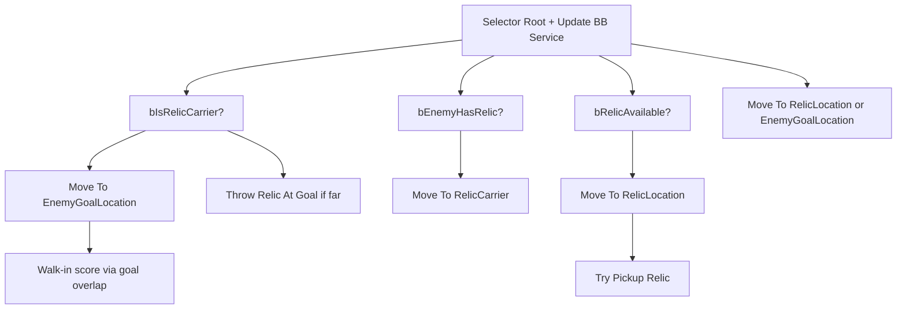

# Relic Bot AI — Editor Setup (Step 10)

C++ provides the controller, blackboard updater, and relic interaction tasks. You create the **Blackboard**, **Behavior Tree**, and **Blueprint controller** assets, then wire them on `**BP_BW_GameState` → Bot Creation Component**.

---

## C++ types (reference)


| Type                                   | Role                                                    |
| -------------------------------------- | ------------------------------------------------------- |
| `ABwayRelicBotController`              | Runs `BT_BW_RelicBot` after spawn / round restart       |
| `UBwayBTService_UpdateRelicBlackboard` | Fills blackboard every 0.25s                            |
| `UBwayBTTask_TryPickupRelic`           | Request tag + `TryPickupOverlappingRelic`               |
| `UBwayBTTask_ThrowRelicAtGoal`         | `Server_ThrowRelic` toward enemy goal                   |
| `UBwayBTTask_PassRelicForward`         | `Server_PassRelic` toward forward teammate              |
| `UBwayRelicBotLibrary`                 | Team / relic / goal helpers (optional in BP decorators) |


Blackboard key names are defined in `BwayRelicBotBlackboard.h` — **asset key names must match exactly**.

---

## 1. Blackboard — `BB_BW_RelicBot`

Create: **Content Browser → Artificial Intelligence → Blackboard**.


| Key name             | Type                       | Notes                                              |
| -------------------- | -------------------------- | -------------------------------------------------- |
| `RelicLocation`      | Vector                     | World location of active relic                     |
| `EnemyGoalLocation`  | Vector                     | Enemy team goal center                             |
| `RelicCarrier`       | Object (Base Class: Actor) | Pawn carrying relic; chase target                  |
| `bSuddenDeathActive` | Bool                       | True in final `SuddenDeathWarningSeconds` of round |
| `bIsRelicCarrier`    | Bool                       | This bot carries the relic                         |
| `bEnemyHasRelic`     | Bool                       | Enemy team has possession                          |
| `bRelicAvailable`    | Bool                       | Relic on ground (not carried / scoring)            |
| `MyTeamIndex`        | Int                        | 0 or 1 from `ABwayGameState`                       |


---

## 2. Behavior tree — `BT_BW_RelicBot`

Create: **Behavior Tree** using `BB_BW_RelicBot`.

### Root

- Add **Service**: `Bway BTService Update Relic Blackboard` on the root composite (or on each major selector child).

### Recommended graph




### Node details


| Branch               | Decorator                                                                          | Task / move                                                                                                                                                    |
| -------------------- | ---------------------------------------------------------------------------------- | -------------------------------------------------------------------------------------------------------------------------------------------------------------- |
| **I have relic**     | `Blackboard Based Condition` → `bIsRelicCarrier` Is Set                            | `BTTask_MoveTo` → `EnemyGoalLocation`, Acceptable Radius **~200** (tune to goal size). Walk-in scoring is automatic when the carrier enters `ABwayGoalVolume`. |
| **Throw (optional)** | Same branch, second child: `Blackboard` distance to `EnemyGoalLocation` **>** 2500 | `Bway BTTask Throw Relic At Goal`                                                                                                                              |
| **Enemy has relic**  | `bEnemyHasRelic` Is Set                                                            | `BTTask_MoveTo` → blackboard key `**RelicCarrier`** (Object), radius ~150                                                                                      |
| **Free relic**       | `bRelicAvailable` Is Set                                                           | `Move To` `RelicLocation` (radius ~120) → `Bway BTTask Try Pickup Relic`                                                                                       |
| **Fallback**         | —                                                                                  | `Move To` `RelicLocation` or `EnemyGoalLocation`                                                                                                               |


Use engine `**BTTask_MoveTo`** (AIModule). Ensure **Nav Mesh** covers DevMap midfield and goals.

**Pass (optional):** Under carrier branch, add a selector child: `Bway BTTask Pass Relic Forward` with low priority or a cooldown decorator so bots do not spam pass.

**Sudden death:** No special nodes required for Step 10 pass criteria; `bSuddenDeathActive` is available for future tuning (e.g. more aggressive throw).

---

## 3. Blueprint controller — `BP_BW_RelicBotController`

1. Create Blueprint class parent: `**BwayRelicBotController`** (C++ parent: `AModularAIController`, not `LyraPlayerBotController` — required for Game Feature plugin linking).
2. Set defaults (optional if GameState assigns assets):
  - **Relic Behavior Tree** → `BT_BW_RelicBot`
  - **Relic Blackboard** → `BB_BW_RelicBot`
3. Save under BreakawayCore content folder (e.g. `/Game/BreakawayCore/AI/`).

---

## 4. GameState wiring — `BP_BW_GameState`

On **Bot Creation Component**:


| Property                      | Value                                                                            |
| ----------------------------- | -------------------------------------------------------------------------------- |
| **Bot Controller Class**      | `BP_BW_RelicBotController` (or leave default `BwayRelicBotController` C++ class) |
| **Relic Behavior Tree Asset** | `BT_BW_RelicBot`                                                                 |
| **Relic Blackboard Asset**    | `BB_BW_RelicBot`                                                                 |


Experience `**B_BW_Experience_Dev`** keeps `**B_BW_BotSpawner_BallMode**` for bot count only; AI assets live on GameState.

---

## 5. Bot relic request (pickup prerequisite)

Humans use **`GA_BW_Relic_Request`** → **`GE_BW_Relic_Request`** (`State.RequestingRelic`). Bots do not press input; C++ applies the same effect instead.

On your **Relic Settings** data asset (the one referenced by the spawned relic / `RelicManager`):

| Property | Value |
|----------|--------|
| **Requesting Gameplay Effect Class** | `GE_BW_Relic_Request` |
| **Requesting Tag** | `State.RequestingRelic` (if not already set) |

`UBwayBTService_UpdateRelicBlackboard` calls `ApplyRelicRequestState` every 0.25s while the bot is pursuing a free relic (`bRelicAvailable`, not carrier, enemy does not have ball). `TryBotPickupRelic` applies request state again immediately before pickup.

No separate bot GA is required unless you want custom bot-only behavior.

---

## 6. Build & test

1. **Recompile** `BreakawayCoreRuntime` (new AI `.cpp` files).
2. Create / assign assets above.
3. PIE (listen server):

```
L_BW_DevMap?Experience=B_BW_Experience_Dev&SkipHeroSelection=1&NumBots=7
```

1. Enable **Log LogTemp** if bots do not run BT — look for `BwayRelicBotController: ... running BT_BW_RelicBot`.

### Step 10 pass checklist

- At least one round ends with a **bot-initiated score** (you do not touch the relic)
- You can still move, pickup, throw, and score as human
- **3/3** cold-start runs with a bot score

---

## Troubleshooting


| Symptom                                   | Check                                                                               |
| ----------------------------------------- | ----------------------------------------------------------------------------------- |
| Bots idle, no movement                    | Nav mesh on DevMap; BT running (LogTemp); `RelicBehaviorTreeAsset` set on GameState |
| Bots run to relic but never pick up       | `EAS_BW_CaptureTheRelic` / pickup action set on experience; overlap at relic        |
| Pickup works in PIE as human but not bots | On relic **Relic Settings** data asset, set **Requesting Gameplay Effect Class** → `GE_BW_Relic_Request`. BT service refreshes request while `bRelicAvailable`. |
| BT fails to start                         | Blackboard asset assigned; BB key names match table above                           |
| No score on goal approach                 | Goal volumes spawned; `OwningTeam` matches enemy of carrier                         |


---

## Related

- [CoreLoop_Implementation_Plan.md](./CoreLoop_Implementation_Plan.md) — Step 10
- [Relic_System.md](./Relic_System.md)

